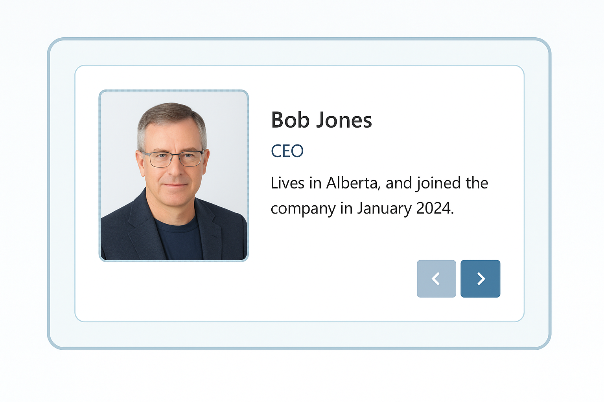

# 👥 Staff Carousel Web Part (SPFx)

This lightweight SharePoint Framework (SPFx) web part dynamically displays staff profiles from a JSON file hosted in SharePoint. One profile is shown at a time with clean, modern styling and simple navigation controls.

> 📌 Great for intranet homepages, team sites, or department landing pages!

---

## ✨ Features

- ✅ Reads external JSON file from SharePoint
- 🎯 Random staff member shown on load
- ⏮️⏭️ Easy forward/back navigation between profiles
- 📷 Displays staff images with flexible layout and styling
- 🎨 Clean, responsive design using Nord-inspired theme

---

## 📂 File Structure

- `/src/webparts/staffCarousel/StaffCarouselWebPart.ts` – Main web part logic
- `SiteAssets/teamCarousel/data.json` – JSON file with staff details
- `SiteAssets/teamCarousel/photos-people/` – Staff profile images

---

## 🛠 JSON Format

```json
{
  "people": [
    {
      "dateJoined": "2024-01-01",
      "title": "CEO",
      "name": "Bob Jones",
      "details": "Lives in Alberta, and joined the company in January 2024.",
      "photoURL": "https://yourtenant.sharepoint.com/sites/IT/SiteAssets/teamCarousel/photos-people/jr.jpg"
    }
  ]
}
```

---

## 🚀 Getting Started

1. Clone the repo
2. Run `npm install`
3. Run `gulp serve`
4. Test using your SharePoint workbench:  
   `https://yourtenant.sharepoint.com/sites/YourSite/_layouts/15/workbench.aspx`
5. Upload your `data.json` and staff images to a SharePoint document library (e.g., `SiteAssets`)

---

## 🧼 Notes

- No React or heavy frameworks – pure SPFx + vanilla TypeScript
- No tenant-specific info is included in this repo
- You can easily adapt this to load different JSON structures or include filtering by department, date, etc.

---

## 📸 Preview



---

## 🔐 License

MIT – free to use, modify, and adapt to your intranet needs.

## 📧 Contact Me

Need custom work done?  Or modifications to this?

<a href="https://erniejohnson.ca"></a>&nbsp;<a href="mailto:ej8899@gmail.com" target="_blank"></a>&nbsp;<a href="https://www.linkedin.com/in/ernie-johnson/" target="_blank"></a>&nbsp;<a href="https://twitter.com/ejdevscom" target="_blank"></a>&nbsp;<a href="https://www.youtube.com/@erniejohnsonca?sub_confirmation=1"></a>&nbsp;<a href="https://docs.google.com/document/d/1XCs8Z_gpaNc00l_rLoan0M1W8Td2Sg_DGThWnMTqOpc/edit?usp=sharing"></a>

